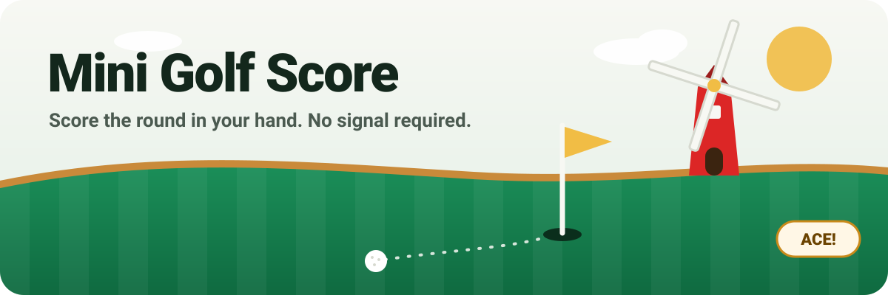
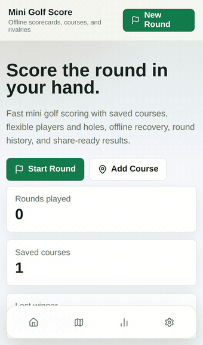
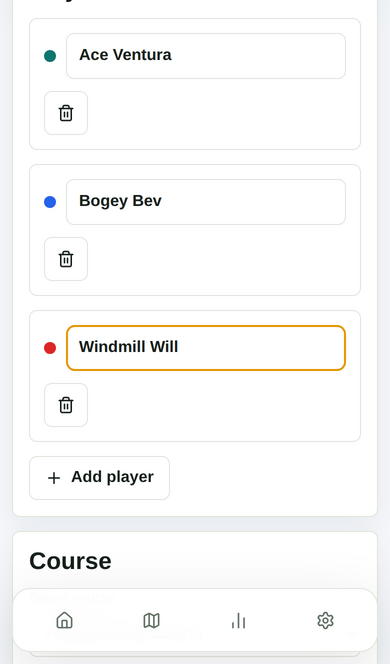
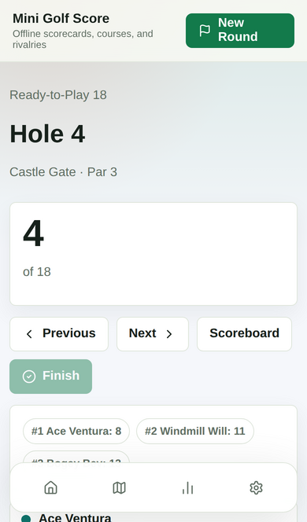
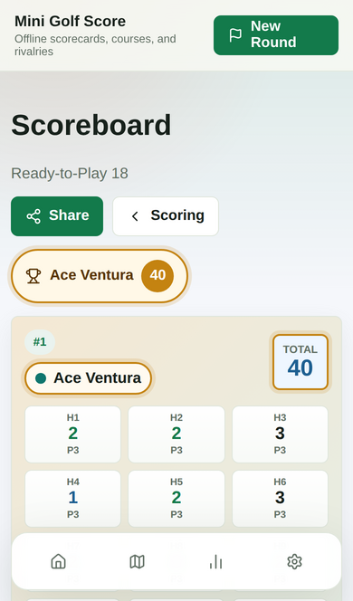
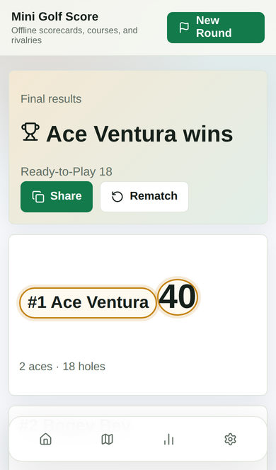
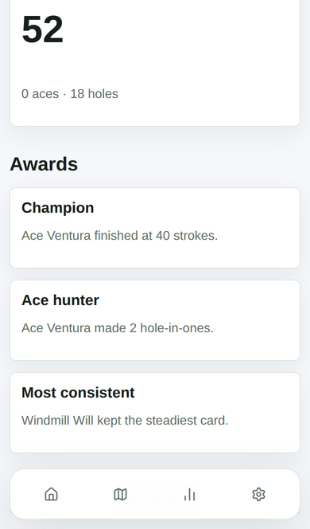
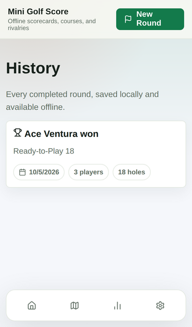

<p align="center">
  
</p>

<p align="center">
  <a href="https://mingolfscore.netlify.app"><b>⛳ Play now at mingolfscore.netlify.app</b></a>
</p>

<p align="center">
  
  
  
  
  
</p>

---

> *The windmill is spinning. The pencil is blunt. The scorecard is soggy from the water hazard on hole 10,
> and someone in your group is quietly claiming they got a two.*
>
> **Put the pencil down.**

**Mini Golf Score** is an offline-first Progressive Web App for scoring mini golf with one thumb, at a
sticky outdoor table, with no signal. Save your local courses and track every rivalry. When the 18th hole
eats your ball, the results are ready to share.

<p align="center">
  
</p>

## 🏌️ The round, hole by hole

<table>
  <tr>
    <td align="center" width="33%">
      <br>
      <b>1. Tee off</b><br>
      <sub>Name your players, pick a course (or use the built-in <i>Ready-to-Play 18</i>), and go.</sub>
    </td>
    <td align="center" width="33%">
      <br>
      <b>2. Tap, tap, putt</b><br>
      <sub>Big quick-score buttons for every player, a live leaderboard, and auto-save on every tap.</sub>
    </td>
    <td align="center" width="33%">
      <br>
      <b>3. Check the card</b><br>
      <sub>Full scorecard with aces, birdies and bogeys colour-coded. Tap any hole to fix a "miscount".</sub>
    </td>
  </tr>
  <tr>
    <td align="center">
      <br>
      <b>4. Crown a champion</b><br>
      <sub>Rankings, bragging rights, and one-tap sharing to the group chat.</sub>
    </td>
    <td align="center">
      <br>
      <b>5. Hand out trophies</b><br>
      <sub><i>Champion</i>, <i>Ace hunter</i>, <i>Most consistent</i>, <i>Photo finish</i>, so everybody gets something.</sub>
    </td>
    <td align="center">
      <br>
      <b>6. Remember everything</b><br>
      <sub>Every finished round is saved on your device, ready to settle future arguments.</sub>
    </td>
  </tr>
</table>

## ✨ What's in the bag

| | |
|---|---|
| 📴 **Truly offline** | Installable PWA with a service worker. Rounds live in IndexedDB (via Dexie), so a dead zone won't cost you a stroke. |
| 👨‍👩‍👧‍👦 **Any number of players** | From a solo practice round to the whole stag do. Regulars are remembered for quick re-adding. |
| 🗺️ **Your courses** | Build courses with 1–36 holes and custom hole names (*Windmill*, *Volcano*, *Castle Gate*…) and pars. Edit, duplicate or archive them. |
| ⚡ **One-thumb scoring** | Quick buttons 1–7, plus/minus, tap to clear. Every change saves immediately. |
| 🏆 **Fair live leaderboard** | Ranked against par on the holes played, so whoever hasn't putted yet can't sneak into first place. |
| 🔁 **Rematch** | One tap restarts with the same players on the same course. Revenge is a dish best served on hole 1. |
| 📤 **Share anywhere** | Native share sheet, with clipboard fallback, for a tidy text scorecard. |
| 💾 **Backups** | Export and import everything as JSON, or wipe the slate clean. |

## 🚀 Getting started

```bash
npm install
npm run dev
```

Then open <http://localhost:3000> and grab your putter.

> 💡 The service worker only registers in production builds. To test install and offline behaviour, run
> `npm run build && npm start`.

## 🧰 Tech stack

**Next.js 15** (App Router) · **React 19** · **TypeScript** · **Dexie / IndexedDB** · **Lucide icons** · **Netlify**

```text
app/          routes: home, new round, scoring, scoreboard, results, courses, history, settings
components/   client screens (all data lives in the browser)
lib/          scoring + ranking + awards, Dexie database, hooks, share helper
public/       service worker, manifest, icon
```

## ✅ Checks before you putt

```bash
npm run typecheck     # TypeScript
npm run build         # production build
npm audit --omit=dev  # production dependency audit
```

## ☁️ Deployment

Deploys to Netlify out of the box using `netlify.toml`:

```toml
[build]
  command = "npm run build"
```

Netlify's Next.js runtime handles the rest.

## 📐 Product plan

The full product and technical plan is in [MINIGOLF_PWA_PLAN.md](./MINIGOLF_PWA_PLAN.md).

## 📜 License

[MIT](./LICENSE). Free to use, fork and putt.

<p align="center"><sub>Made for sunny afternoons, sticky scorecards, and settling who <i>really</i> won. ⛳</sub></p>
